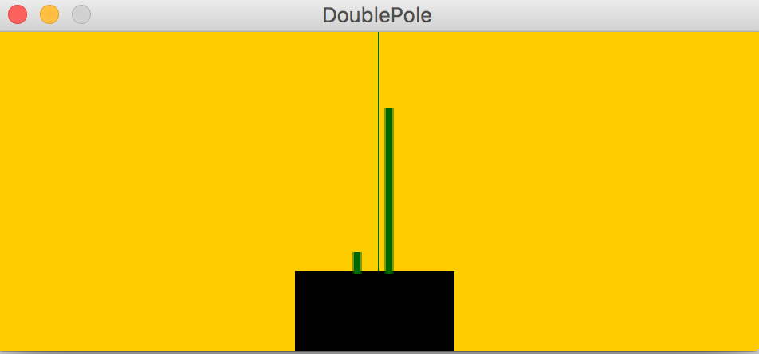
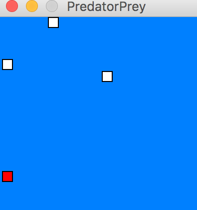

[](https://magnum.travis-ci.com/edmore/cooperative-coevolution)

Cooperative Co-Evolution in Go(lang)

This work was done in fulfillment of a _Masters Degree in Computer Science_ at the University of Cape Town.

Dissertation: **_Accelerated Cooperative Co-Evolution on Multi-core Architectures_**.

Abstract:

```
The Cooperative Co-Evolution (CC) model has been used in Evolutionary Computation
(EC) to optimize the training of artificial neural networks (ANNs). This architecture has
proven to be a useful extension to domains such as Neuro-Evolution (NE), which is the
training of ANNs using concepts of natural evolution. However, there is a need for real-time
systems and the ability to solve more complex tasks which has prompted a further need
to optimize these CC methods. CC methods consist of a number of phases, however the
evaluation phase is still the most compute intensive phase, for some complex tasks taking as
long as weeks to complete. This study uses NE as a test case study and we design a parallel
CC processing framework and implement the optimized serial and parallel versions using
the Go programming language. Go is a multi-core programming language with first-class
constructs, channels and goroutines, that make it well suited to parallel programming. Our
study focuses on Enforced Subpopulations (ESP) for single-agent systems and Multi-Agent
ESP for multi-agent systems. We evaluate the parallel versions in the benchmark tasks;
double pole balancing and prey-capture, for single and multi-agent systems respectively, in
tasks of increasing complexity. We observe a maximum speed-up of 20x for the parallel
Multi-Agent ESP implementation over our single core optimized version in the prey-capture
task and a maximum speedup of 16x for ESP in the harder version of double pole balancing
task. We also observe linear speed-ups for the difficult versions of the tasks for a certain
range of cores, indicating that the Go implementations are efficient and that the parallel
speed-ups are better for more complex tasks. We find that in complex tasks, the Cooperative
Co-Evolution Neuro-Evolution (CCNE) methods are amenable to multi-core acceleration,
which provides a basis for the study of even more complex CC methods in a wider range of
domains.
```

The author of this work is **_Edmore T. Moyo_**.

Each implementation is in _its own branch_, this repository has the following implementations:

- master - the master branch contains the blue-print parallel algorithm, it is based on the initial Enforced Subpopulations (ESP) parallel implementation. It can be used as a starting point for the parallelization of other Cooperative Co-Evolution methods. The actual implementations of the Cooperative Co-Evolution Neuro-Evolution methods are available in their own repository branches.
- **esp-serial** - the serial implementation of the ESP method in the double pole balancing task (supports Markov and non-Markov versions).
- **esp-parallel** - the _parallel_ implementation of the ESP method in the double pole balancing task  (supports Markov and non-Markov versions).
-  **multi-agent-esp-serial** - the serial implementation of the Multi-Agent ESP method in the prey-capture task (prey starts at one starting position [50,50]).
- **multi-agent-esp-serial-custom** - the serial implementation of the Multi-Agent ESP method in the prey-capture task (prey starts at nine different defined positions for each trial).
- **multi-agent-esp-parallel** - the _parallel_ implementation of the Multi-Agent ESP method in the prey-capture task (preys start at nine different defined positions for each trial).
- **sane-serial** - the serial implementation of our _neuron_ Symbiotic, Adaptive Neuro-Evolution (SANE) method in the double pole balancing task.
- **sane-parallel** - the _parallel_ implementation of our _neuron_ SANE method in the double pole balancing task.


The _single-agent_ (ESP and neuron SANE) and _multi-agent_ (Multi-Agent ESP) methods were validated and benchmarked in the double pole balancing and prey-capture tasks respectively.

 

Validation visualizations are available for download: https://www.dropbox.com/s/df5l30p1g9kz1aq/Validation_visualizations.zip
